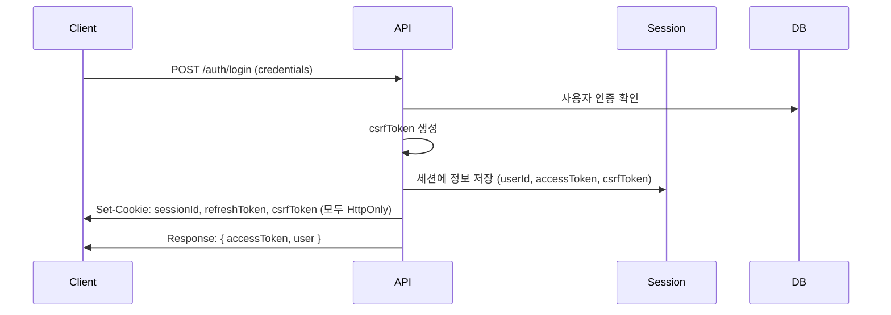
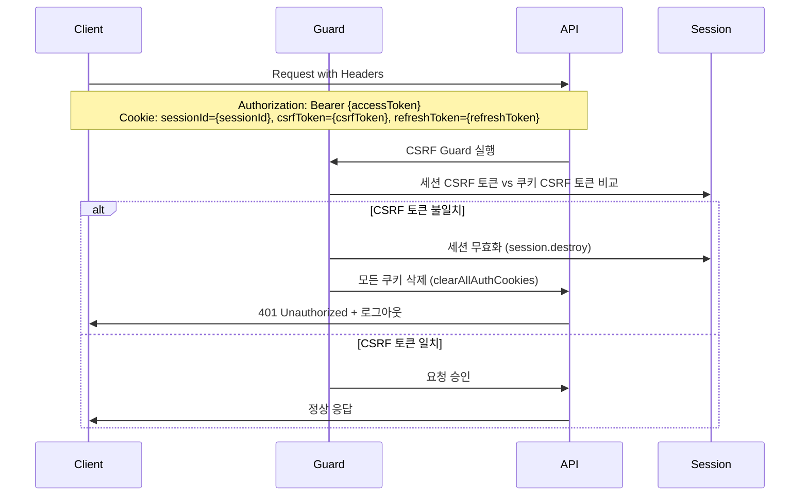

# CODEX.md

## Project Overview

이 프로젝트는 pnpm 기반 모노레포로 관리되며, 여러 개의 백엔드 서비스, 프론트엔드
애플리케이션, 그리고 공유 패키지로 구성된 모노레포 솔루션 프로젝트입니다.
프로젝트 내 모든 애플리케이션은 TypeScript를 사용하며, 워크스페이스 기반
아키텍처를 따릅니다.

## Architecture

### Workspace Structure

- **apps/api/lh-cs-be**: NestJS backend for consultation service (LH Customer
  Service Backend)
- **apps/api/es-ws-be**: NestJS WebSocket backend for real-time communication
- **apps/web/lh-cs-fe**: React frontend application with Vite
- **packages/**: Shared utilities and components
  - **traveler**: Core Babylon.js-based 3D visualization package
  - **shared**: Shared types and utilities

### Technology Stack

- **Backend**: NestJS, TypeORM, MySQL, JWT, WebSocket (Socket.io)
- **Frontend**: React 18.3.1, TypeScript, Vite, MUI 6.1.6, Zustand, React Query
- **3D Graphics**: Babylon.js 6.11.1
- **Package Management**: pnpm with workspace support
- **Database**: MySQL with TypeORM

## Common Development Commands

### Root Level Commands

```bash
# Install dependencies (builds traveler package first)
pnpm install

# Apply patches
pnpm postinstall

# Lint entire project
pnpm lint

# Format all files
pnpm format
```

### Backend Services

#### LH-CS-BE (Consultation Service)

```bash
cd apps/api/lh-cs-be
pnpm start:local     # Development with NODE_ENV=local
pnpm start:dev       # Development with NODE_ENV=dev
pnpm start:prod      # Production mode
pnpm build           # Build for production
pnpm test            # Run Jest tests
pnpm test:e2e        # End-to-end tests
pnpm lint            # ESLint with auto-fix
```

#### ES-WS-BE (WebSocket Service)

```bash
cd apps/api/es-ws-be
pnpm start:local     # Development with NODE_ENV=local
pnpm start:dev       # Development with NODE_ENV=dev
pnpm start:prod      # Production mode
pnpm build           # Build for production
pnpm test            # Run Jest tests
```

### Frontend Application

#### LH-CS-FE (React Frontend)

```bash
cd apps/web/lh-cs-fe
pnpm dev             # Development server
pnpm build:dev       # Build for development
pnpm build:prd       # Build for production
pnpm test            # Run Vitest
pnpm test:coverage   # Test with coverage
pnpm lint            # ESLint check
pnpm lint:fix        # ESLint with auto-fix
pnpm lint:naming     # Check file/folder naming conventions
```

### Package Development

#### Traveler Package (Core 3D Component)

```bash
cd packages/traveler
pnpm dev             # Development mode
pnpm build           # Build library
pnpm test            # Run tests
```

## Key Implementation Details

### Backend Architecture

- Uses NestJS with **Layered Architecture** following strict layer separation
  principles
- Implements JWT-based authentication with role-based access control
- TypeORM for database operations with MySQL
- WebSocket communication for real-time features
- Comprehensive API documentation with Swagger

### Database Conventions

- 비즈니스 상태 컬럼은 ENUM 대신 `VARCHAR(16)` + `CHECK` 제약으로 정의합니다.
- 기존 ENUM 컬럼은
  `apps/api/lh-cs-be/database/migrations/20250309_replace_enum_status_check.sql`
  스크립트로 일괄 전환합니다.
- TypeORM 엔티티는 `type: 'varchar'` + `length`를 사용하고, 허용 값 검증은
  `@Check` 데코레이터로 선언합니다.
- 신규 스키마 문서와 SQL 예시는 모두 CHECK 기반 문자열 설계를 따릅니다.

#### Layered Architecture Structure

**📁 /docs**

- BE 관련 문서

**🎯 /presentation (프레젠테이션 계층)**

- `/controller`: 모든 컨트롤러
- `/dto`: 데이터 전송 객체
  - `/request`: 요청 DTO
  - `/response`: 응답 DTO

**⚙️ /application (애플리케이션 계층)**

- `/service`: 모든 비즈니스 서비스 로직
- `/model`: 도메인 모델 객체
  - `/command`: DB insert, update, delete 로직에 사용되는 DTO
  - `/query`: DB select에 사용되는 DTO
- `/module`: NestJS 모듈 관리

**🗄️ /infrastructure (인프라스트럭처 계층)**

- `/repository`: 데이터 접근 계층
- `/entity`: 데이터베이스 테이블 매핑 엔티티
  - 테이블 enum 값은 entity 파일 내에서 관리

**🔧 /common (공통 계층)**

- `/decorator`: 커스텀 데코레이터
- `/dto`: 공통 DTO (common-response 등)
- `/enum`: 공통 enum 정의
- `/exception`: 예외 처리
  - `/error`: error code enum 별도 정의
  - `/filter`: 글로벌 필터 정의
- `/guard`: 가드 정의
- `/strategy`: 인증 전략
- `/utils`: 공통 유틸리티 함수
- `/config`: DB config 등 설정

#### 레이어 간 의존성 규칙

**단방향 Import 원칙**

- 하위 레이어 → 상위 레이어 import 허용
- 상위 레이어 → 하위 레이어 import **금지**
- 같은 레이어 간 import 허용

**허용되는 Import 방향**

```
Infrastructure → Application → Presentation
     ↑              ↑              ↑
  Common ←-------- Common ←-------- Common
```

#### 객체 변환 메소드 규칙

**DTO Static 메소드**

- `toModel()`: DTO → Model 변환
- `fromModel()`: Model → DTO 변환

**Model Static 메소드**

- `toEntity()`: Model → Entity 변환
- `fromEntity()`: Entity → Model 변환

**Mapper 관리**

- 각 DTO/Model에서 자체적으로 mapper 관리
- 단방향 import 원칙에 따라 변환 메소드 배치

#### 파일명 규칙 (File Naming Conventions)

**Presentation Layer (DTO)**

- **Request**: `create-entity.request.ts`, `update-entity.request.ts`
- **Response**: `get-entity.response.ts`, `create-entity.response.ts`
- **공통 DTO**: `entity.dto.ts` (여러 용도로 재사용되는 DTO)
- **순수 DTO**: `some-dto.dto.ts` (특정 용도의 독립적인 DTO)

**Application Layer (Model)**

- **Command**: `create-entity.command.ts`, `update-entity.command.ts`
- **Query**: `get-entity.query.ts`, `search-entity.query.ts`
- **공통 Model**: `entity.model.ts` (여러 용도로 재사용되는 Model)
- **순수 Model**: `some-model.model.ts` (특정 용도의 독립적인 Model)

**상속 구조 권장사항**

```typescript
// 공통 DTO (여러 endpoint에서 재사용)
export class ConsultationDto {
  // 공통 필드들
}

// 특정 Response 클래스들이 상속
export class GetConsultationResponse extends ConsultationDto {
  static fromModel(model: ConsultationModel): GetConsultationResponse {
    // 변환 로직
  }
}

export class CreateConsultationResponse extends ConsultationDto {
  static fromModel(model: ConsultationModel): CreateConsultationResponse {
    // 변환 로직
  }
}
```

#### CQRS 아키텍처 (Command Query Responsibility Segregation)

**Write/Read 분리 원칙**

- Command(Write): 정규화된 테이블 구조 사용
- Query(Read): 비정규화된 Read Table 설계

**테이블 설계 전략**

```
Write Tables (정규화)     →     Read Tables (비정규화)
┌─────────────────┐            ┌──────────────────────┐
│ users           │            │ user_consultation_   │
│ consultations   │     동기화   │ read_view           │
│ consultation_   │      →     │ - 조인된 데이터      │
│ participants    │            │ - 캐시된 계산값      │
│ messages        │            │ - 검색 최적화        │
└─────────────────┘            └──────────────────────┘
```

**Read Table 설계 규칙**

- 복잡한 JOIN이 필요한 조회를 위한 비정규화 테이블
- Write 시점에 Read Table 자동 업데이트
- 검색 성능 최적화를 위한 인덱스 설계
- 계산된 필드와 집계 데이터 포함

**CQRS 구현 패턴**

- **Command**: 정규화된 테이블에 대한 CUD 작업
- **Query**: Read Table 또는 정규화된 테이블에서 조회
- **동기화**: Command 실행 시 Read Table 업데이트 로직 포함

**예시 구조**

```typescript
// Write Entity (정규화)
@Entity('consultations')
export class ConsultationEntity {
  @PrimaryGeneratedColumn('uuid')
  id: string;

  @ManyToOne(() => UserEntity)
  consultant: UserEntity;

  @OneToMany(() => ParticipantEntity)
  participants: ParticipantEntity[];
}

// Read Entity (비정규화)
@Entity('consultation_read_view')
export class ConsultationReadViewEntity {
  @PrimaryGeneratedColumn('uuid')
  id: string;

  @Column()
  consultantName: string; // JOIN 결과 캐시

  @Column()
  participantCount: number; // 계산된 값

  @Column()
  lastMessageAt: Date; // 집계 데이터
}
```

#### 데이터 타입 규칙

**ID 관리**

- 모든 테이블 ID: `bigint` 또는 `uuid` 타입
- TypeScript 소스에서는 **모두 string으로 관리**
- 정밀도 부정합 방지를 위한 조치
- TypeORM에서 bigint ID는 기본적으로 string으로 처리

### Frontend Architecture

- **FSD (Feature-Sliced Design)** 아키텍처 기반 구조
- Layer별 명확한 책임 분리와 단방향 의존성
- MUI-based component library with custom theming
- Zustand for global state management
- React Query for server state management
- Responsive design with mobile-first approach

#### FSD (Feature-Sliced Design) 아키텍처 구조

##### 1. 아키텍처 개요

**기본 원칙**

- **FSD (Feature-Sliced Design)** 아키텍처 기반 구조
- Layer별 명확한 책임 분리
- 단방향 의존성 (상위 → 하위)
- 기능별 독립성과 재사용성 극대화
- **kebab-case** 파일명 규칙 적용

**기술 스택**

- **React 18.3.1** + TypeScript
- **Vite** 번들러
- **MUI 6.1.6** 컴포넌트 라이브러리
- **Zustand** 전역 상태 관리
- **React Query** 서버 상태 관리
- **Babylon.js 6.11.1** 3D 시각화

##### 2. Layer 구조 (계층별 구성)

```
src/
├── 🏠 app/           # Application Layer (앱 진입점)
├── 📄 pages/         # Pages Layer (라우팅 페이지)
├── 🎯 widgets/       # Widgets Layer (복합 UI 블록)
├── ⚡ features/      # Features Layer (비즈니스 기능)
├── 🧩 entities/      # Entities Layer (비즈니스 엔티티)
└── 🔧 shared/        # Shared Layer (공통 리소스)
```

**의존성 규칙**

```
app → pages → widgets → features → entities → shared
```

**⚠️ 역방향 import 금지**: 하위 레이어는 상위 레이어를 import할 수 없음

##### 3. 각 Layer 상세 구조

**🏠 App Layer (앱 설정)**

```
app/
├── index.tsx                 # 앱 진입점 및 Root 컴포넌트
├── providers/                # 전역 프로바이더
│   ├── auth-provider.tsx     # 인증 컨텍스트
│   ├── theme-provider.tsx    # MUI 테마 프로바이더
│   ├── query-provider.tsx    # React Query 설정
│   └── index.tsx             # 프로바이더 조합
├── router/                   # 라우터 설정
│   ├── app-router.tsx        # 메인 라우터
│   ├── private-route.tsx     # 인증 라우트
│   └── routes.ts             # 라우트 정의
└── styles/                   # 전역 스타일
    ├── globals.css
    ├── theme.ts              # MUI 테마 설정
    └── variables.css
```

**📄 Pages Layer (라우팅)**

```
pages/
├── login-page/
│   ├── index.tsx             # 페이지 컴포넌트
│   ├── ui/
│   │   └── login-page.tsx
│   └── model/
│       └── login-page-store.ts
├── consultation-page/
│   ├── index.tsx
│   ├── ui/
│   │   └── consultation-page.tsx
│   └── model/
│       └── consultation-page-store.ts
├── dashboard-page/
│   ├── index.tsx
│   ├── ui/
│   │   └── dashboard-page.tsx
│   └── model/
└── not-found-page/
    ├── index.tsx
    └── ui/
        └── not-found-page.tsx
```

**🎯 Widgets Layer (복합 UI 블록)**

```
widgets/
├── consultation-room/        # 상담방 전체 위젯
│   ├── index.ts              # Public API
│   ├── ui/
│   │   ├── consultation-room.tsx
│   │   ├── components/       # 내부 컴포넌트
│   │   │   ├── video-panel.tsx
│   │   │   ├── chat-panel.tsx
│   │   │   └── whiteboard-panel.tsx
│   │   └── consultation-room.module.css
│   ├── model/
│   │   ├── consultation-room-store.ts
│   │   ├── consultation-room-types.ts
│   │   └── selectors.ts
│   ├── api/
│   │   └── consultation-room-api.ts
│   └── lib/
│       └── websocket-client.ts
├── user-profile/             # 사용자 프로필 위젯
│   ├── index.ts
│   ├── ui/
│   │   ├── user-profile.tsx
│   │   └── components/
│   ├── model/
│   │   └── user-profile-store.ts
│   └── api/
│       └── user-profile-api.ts
├── navigation-bar/           # 네비게이션 바
│   ├── index.ts
│   ├── ui/
│   │   ├── navigation-bar.tsx
│   │   └── components/
│   │       ├── nav-menu.tsx
│   │       └── user-menu.tsx
│   └── model/
│       └── navigation-store.ts
└── three-d-viewer/           # 3D 뷰어 위젯
    ├── index.ts
    ├── ui/
    │   ├── three-d-viewer.tsx
    │   └── components/
    ├── model/
    │   └── three-d-viewer-store.ts
    └── lib/
        └── babylon-integration.ts
```

**⚡ Features Layer (비즈니스 기능)**

```
features/
├── authentication/           # 인증 기능
│   ├── index.ts              # Public API
│   ├── ui/
│   │   ├── login-form/
│   │   │   ├── index.ts
│   │   │   ├── login-form.tsx
│   │   │   └── login-form.module.css
│   │   ├── logout-button/
│   │   │   ├── index.ts
│   │   │   └── logout-button.tsx
│   │   ├── password-reset/
│   │   │   ├── index.ts
│   │   │   └── password-reset-form.tsx
│   │   └── session-warning/
│   │       ├── index.ts
│   │       └── session-warning.tsx
│   ├── model/
│   │   ├── auth-store.ts     # Zustand 스토어
│   │   ├── auth-types.ts     # 타입 정의
│   │   ├── auth-selectors.ts # 셀렉터
│   │   └── auth-hooks.ts     # 커스텀 훅
│   ├── api/
│   │   ├── auth-api.ts       # API 호출
│   │   └── auth-queries.ts   # React Query
│   └── lib/
│       ├── token-utils.ts    # 토큰 관리
│       └── csrf-utils.ts     # CSRF 토큰
├── consultation/             # 상담 기능
│   ├── ui/
│   │   ├── create-consultation/
│   │   │   ├── index.ts
│   │   │   └── create-consultation-form.tsx
│   │   ├── join-consultation/
│   │   │   ├── index.ts
│   │   │   └── join-consultation-modal.tsx
│   │   ├── consultation-list/
│   │   │   ├── index.ts
│   │   │   └── consultation-list.tsx
│   │   └── consultation-status/
│   │       ├── index.ts
│   │       └── consultation-status-badge.tsx
│   ├── model/
│   │   ├── consultation-store.ts
│   │   ├── consultation-types.ts
│   │   └── consultation-hooks.ts
│   ├── api/
│   │   ├── consultation-api.ts
│   │   └── consultation-queries.ts
│   └── lib/
│       └── consultation-utils.ts
├── messaging/                # 실시간 메시징
│   ├── ui/
│   │   ├── message-input/
│   │   │   ├── index.ts
│   │   │   └── message-input.tsx
│   │   ├── message-list/
│   │   │   ├── index.ts
│   │   │   └── message-list.tsx
│   │   └── message-bubble/
│   │       ├── index.ts
│   │       └── message-bubble.tsx
│   ├── model/
│   │   ├── messaging-store.ts
│   │   └── messaging-types.ts
│   └── api/
│       └── messaging-api.ts
├── whiteboard/               # 화이트보드 기능
│   ├── ui/
│   │   ├── whiteboard-canvas/
│   │   │   ├── index.ts
│   │   │   └── whiteboard-canvas.tsx
│   │   ├── drawing-tools/
│   │   │   ├── index.ts
│   │   │   └── drawing-toolbar.tsx
│   │   └── shape-selector/
│   │       ├── index.ts
│   │       └── shape-selector.tsx
│   ├── model/
│   │   ├── whiteboard-store.ts
│   │   └── whiteboard-types.ts
│   └── lib/
│       └── canvas-utils.ts
└── video-call/               # 화상통화 기능
    ├── ui/
    │   ├── video-player/
    │   │   ├── index.ts
    │   │   └── video-player.tsx
    │   └── call-controls/
    │       ├── index.ts
    │       └── call-controls.tsx
    ├── model/
    │   ├── video-call-store.ts
    │   └── video-call-types.ts
    └── lib/
        └── webrtc-utils.ts
```

**🧩 Entities Layer (비즈니스 엔티티)**

```
entities/
├── user/                     # 사용자 엔티티
│   ├── index.ts
│   ├── ui/
│   │   ├── user-card/
│   │   │   ├── index.ts
│   │   │   ├── user-card.tsx
│   │   │   └── user-card.module.css
│   │   ├── user-avatar/
│   │   │   ├── index.ts
│   │   │   └── user-avatar.tsx
│   │   └── user-status/
│   │       ├── index.ts
│   │       └── user-status-indicator.tsx
│   ├── model/
│   │   ├── user-types.ts     # 사용자 관련 타입
│   │   ├── user-store.ts     # 사용자 상태
│   │   ├── user-selectors.ts # 데이터 셀렉터
│   │   └── user-hooks.ts     # 사용자 관련 훅
│   └── api/
│       ├── user-api.ts
│       └── user-queries.ts
├── consultation/             # 상담 엔티티
│   ├── ui/
│   │   ├── consultation-card/
│   │   │   ├── index.ts
│   │   │   └── consultation-card.tsx
│   │   ├── consultation-status/
│   │   │   ├── index.ts
│   │   │   └── consultation-status.tsx
│   │   └── consultation-timer/
│   │       ├── index.ts
│   │       └── consultation-timer.tsx
│   ├── model/
│   │   ├── consultation-types.ts
│   │   ├── consultation-store.ts
│   │   └── consultation-selectors.ts
│   └── api/
│       ├── consultation-api.ts
│       └── consultation-queries.ts
├── message/                  # 메시지 엔티티
│   ├── ui/
│   │   ├── message-bubble/
│   │   │   ├── index.ts
│   │   │   └── message-bubble.tsx
│   │   └── message-timestamp/
│   │       ├── index.ts
│   │       └── message-timestamp.tsx
│   ├── model/
│   │   ├── message-types.ts
│   │   └── message-store.ts
│   └── api/
│       └── message-api.ts
└── session/                  # 세션 엔티티
    ├── ui/
    │   ├── session-timer/
    │   │   ├── index.ts
    │   │   └── session-timer.tsx
    │   └── session-indicator/
    │       ├── index.ts
    │       └── session-indicator.tsx
    ├── model/
    │   ├── session-types.ts
    │   ├── session-store.ts
    │   └── session-selectors.ts
    └── api/
        └── session-api.ts
```

**🔧 Shared Layer (공통 리소스)**

```
shared/
├── ui/                       # 공통 UI 컴포넌트
│   ├── button/
│   │   ├── index.ts
│   │   ├── button.tsx
│   │   └── button.module.css
│   ├── input/
│   │   ├── index.ts
│   │   ├── input.tsx
│   │   └── input.module.css
│   ├── modal/
│   │   ├── index.ts
│   │   ├── modal.tsx
│   │   └── modal.module.css
│   ├── spinner/
│   │   ├── index.ts
│   │   └── spinner.tsx
│   └── toast/
│       ├── index.ts
│       └── toast.tsx
├── lib/                      # 공통 유틸리티
│   ├── utils/
│   │   ├── date-formatter.ts
│   │   ├── string-utils.ts
│   │   ├── validation.ts
│   │   └── format-utils.ts
│   ├── hooks/
│   │   ├── use-local-storage.ts
│   │   ├── use-debounce.ts
│   │   ├── use-websocket.ts
│   │   └── use-media-query.ts
│   ├── constants/
│   │   ├── app-constants.ts
│   │   ├── api-endpoints.ts
│   │   └── validation-rules.ts
│   └── types/
│       ├── common-types.ts
│       ├── api-types.ts
│       └── ui-types.ts
├── api/                      # 공통 API 설정
│   ├── base-api.ts           # Axios 기본 설정
│   ├── interceptors.ts       # HTTP 인터셉터
│   ├── query-client.ts       # React Query 설정
│   └── error-handler.ts      # 에러 처리
└── config/                   # 설정 파일
    ├── app-config.ts         # 앱 설정
    ├── theme-config.ts       # 테마 설정
    └── env-config.ts         # 환경 변수
```

##### 4. 파일명 및 폴더명 규칙

**Naming Convention**

- **모든 파일과 폴더**: `kebab-case` 사용
- **컴포넌트 파일**: `component-name.tsx`
- **타입 파일**: `component-name.types.ts`
- **스토어 파일**: `component-name.store.ts`
- **API 파일**: `component-name.api.ts`
- **훅 파일**: `use-hook-name.ts`
- **유틸 파일**: `utility-name.ts`

**예시**

```
✅ 올바른 파일명
- user-profile.tsx
- consultation-room-store.ts
- auth-api.ts
- use-websocket.ts
- date-formatter.ts

❌ 잘못된 파일명
- UserProfile.tsx
- consultationRoomStore.ts
- authApi.ts
- useWebSocket.ts
- dateFormatter.ts
```

##### 5. Segment 구조 (각 슬라이스 내부)

**표준 Segment 구조**

```
feature-name/
├── index.ts          # Public API (re-export)
├── ui/               # UI 컴포넌트
├── model/            # 비즈니스 로직, 상태, 타입
├── api/              # API 호출 관련
└── lib/              # 유틸리티, 헬퍼 함수
```

**Public API 패턴 (index.ts)**

```typescript
// features/authentication/index.ts
export { LoginForm } from './ui/login-form';
export { LogoutButton } from './ui/logout-button';
export { useAuth } from './model/auth-hooks';
export { authStore } from './model/auth-store';
export type { AuthUser, LoginCredentials } from './model/auth-types';
```

##### 6. Import 규칙 및 베스트 프랙티스

**Import 순서**

```typescript
// 1. React 관련
import React, { useState, useEffect } from 'react';

// 2. 외부 라이브러리
import { Button, TextField } from '@mui/material';
import { useQuery } from '@tanstack/react-query';

// 3. 내부 모듈 (상위 → 하위 레이어 순)
import { authApi } from '~/shared/api';
import { useAuth } from '~/entities/user';
import { LoginForm } from '~/features/authentication';

// 4. 상대 경로 (같은 레이어 내)
import { validateForm } from '../lib/validation';
import './component.module.css';
```

**경로 별칭 설정**

```typescript
// vite.config.ts
export default defineConfig({
  resolve: {
    alias: {
      '~': path.resolve(__dirname, './src'),
      '@app': path.resolve(__dirname, './src/app'),
      '@pages': path.resolve(__dirname, './src/pages'),
      '@widgets': path.resolve(__dirname, './src/widgets'),
      '@features': path.resolve(__dirname, './src/features'),
      '@entities': path.resolve(__dirname, './src/entities'),
      '@shared': path.resolve(__dirname, './src/shared'),
    },
  },
});
```

##### 7. 상태 관리 패턴

**Zustand Store 예시**

```typescript
// features/authentication/model/auth-store.ts
import { create } from 'zustand';
import type { AuthUser, AuthState } from './auth-types';

interface AuthStore extends AuthState {
  login: (user: AuthUser, tokens: TokenPair) => void;
  logout: () => void;
  updateUser: (user: Partial<AuthUser>) => void;
}

export const useAuthStore = create<AuthStore>((set, get) => ({
  user: null,
  accessToken: null,
  isAuthenticated: false,

  login: (user, tokens) => {
    set({
      user,
      accessToken: tokens.accessToken,
      isAuthenticated: true,
    });
  },

  logout: () => {
    set({
      user: null,
      accessToken: null,
      isAuthenticated: false,
    });
  },

  updateUser: (userData) => {
    set((state) => ({
      user: state.user ? { ...state.user, ...userData } : null,
    }));
  },
}));
```

##### 8. 컴포넌트 작성 패턴

**표준 컴포넌트 구조**

```typescript
// features/authentication/ui/login-form/login-form.tsx
import React from 'react';
import { Button, TextField, Box } from '@mui/material';
import { useLoginForm } from '../model/use-login-form';
import type { LoginFormProps } from '../model/auth-types';
import styles from './login-form.module.css';

export const LoginForm: React.FC<LoginFormProps> = ({ onSuccess }) => {
  const {
    formData,
    errors,
    isLoading,
    handleInputChange,
    handleSubmit,
  } = useLoginForm({ onSuccess });

  return (
    <Box component="form" onSubmit={handleSubmit} className={styles.form}>
      <TextField
        name="email"
        type="email"
        label="이메일"
        value={formData.email}
        onChange={handleInputChange}
        error={!!errors.email}
        helperText={errors.email}
        fullWidth
        required
      />

      <TextField
        name="password"
        type="password"
        label="비밀번호"
        value={formData.password}
        onChange={handleInputChange}
        error={!!errors.password}
        helperText={errors.password}
        fullWidth
        required
      />

      <Button
        type="submit"
        variant="contained"
        fullWidth
        loading={isLoading}
        disabled={isLoading}
      >
        로그인
      </Button>
    </Box>
  );
};
```

##### 9. 장점 및 특징

**확장성**

- **모듈화**: 기능별 독립적 개발 가능
- **재사용성**: 엔티티와 공통 컴포넌트 재활용
- **유지보수성**: 명확한 책임 분리로 수정 영향도 최소화

**개발 경험**

- **타입 안정성**: TypeScript 기반 엄격한 타이핑
- **일관성**: 표준화된 폴더 구조와 네이밍 규칙
- **협업 효율성**: 레이어별 역할 분담 명확

**성능 최적화**

- **Tree Shaking**: 모듈별 독립적 번들링
- **Code Splitting**: 페이지/기능별 지연 로딩
- **캐싱 전략**: React Query 기반 서버 상태 캐싱

### Database Design

- MySQL database with comprehensive auth and consultation schemas
- User roles and permissions system
- Consultation room management with real-time status updates

### Testing Strategy

- Jest for backend unit and integration tests
- Vitest for frontend testing
- E2E testing capabilities configured
- Test coverage reporting available

### Development Environment

- Environment-specific configurations (local, dev, prd)
- Hot reload for development
- TypeScript strict mode enabled
- ESLint with custom rules for naming conventions

## Important Workspace Dependencies

### Shared Packages

- `@packages/traveler`: Core 3D visualization library
- `@packages/shared`: Common types and utilities across all apps

### External Dependencies

- Babylon.js ecosystem for 3D graphics
- Socket.io for WebSocket communication
- MUI for React component library
- TypeORM for database operations

### Known Issues and Patches

#### dom-helpers Import Issue

**문제**: `dom-helpers@5.2.1` 패키지의 ES 모듈 호환성 문제로 빌드 실패

```
"default" is not exported by "hasClass.d.ts", imported by "addClass.js"
```

**해결책**: `postinstall` 스크립트에서 자동 패치 적용 (크로스 플랫폼 지원)

```json
{
  "scripts": {
    "postinstall": "patch-package && node -e \"const fs = require('fs'); const path = 'node_modules/.pnpm/dom-helpers@5.2.1/node_modules/dom-helpers/esm/addClass.js'; if (fs.existsSync(path)) { const content = fs.readFileSync(path, 'utf8'); fs.writeFileSync(path, content.replace('import hasClass from', 'import * as hasClass from')); }\""
  }
}
```

**장점**: macOS, Linux, Windows 모든 환경과 GitHub Actions에서 동작

**수정 내용**: `import hasClass from './hasClass';` →
`import * as hasClass from './hasClass';`

**적용 파일**:
`node_modules/.pnpm/dom-helpers@5.2.1/node_modules/dom-helpers/esm/addClass.js`

## Development Workflow

### Starting Development

1. Install dependencies: `pnpm install`
2. Start backend services: `pnpm start:local` in backend directories
3. Start frontend: `pnpm dev` in frontend directory
4. Services typically run on different ports with CORS configured

### Code Quality

- Pre-commit hooks configured with Husky
- Lint-staged for staged file linting
- Prettier for code formatting
- TypeScript for type safety

### Environment Configuration

- Uses cross-env for environment variable management
- Timezone set to UTC for backend services
- Environment-specific build configurations

## Special Considerations

### Babylon.js Integration

- Version 6.11.1 used consistently across packages
- Peer dependencies for Babylon.js to avoid version conflicts
- Inspector and materials packages available for debugging

### Authentication System

- JWT-based with refresh token support
- Role-based access control (Manager authentication)
- Cookie-based session management

#### CSRF 방지 인증 시스템 설계

##### 1. 전체 아키텍처 개요

**기본 원칙**

- **Double Submit Cookie Pattern** 사용 (세션 CSRF 토큰 ↔ HttpOnly 쿠키 CSRF
  토큰 비교)
- JWT Access Token + Refresh Token 기반 인증
- 모든 토큰을 HttpOnly 쿠키로 관리하여 XSS 공격 방지
- 세션 무효화를 통한 CSRF 공격 차단
- Real-time WebSocket 연결 보안 강화

**토큰 구조**

```typescript
interface AuthTokens {
  accessToken: string; // JWT (short-lived, 15분) - localStorage 저장
  refreshToken: string; // JWT (long-lived, 7일) - HttpOnly 쿠키
  csrfToken: string; // CSRF 방지 토큰 (세션별 고유) - HttpOnly 쿠키 + 세션
}
```

##### 2. CSRF 토큰 생성 및 관리

**토큰 생성 전략**

```typescript
// CSRF 토큰 생성 (crypto 기반)
export class CsrfTokenService {
  generateCsrfToken(): string {
    return crypto.randomBytes(32).toString('hex');
  }

  // 세션별 CSRF 토큰 저장 (Express Session 메모리)
  storeCsrfToken(session: any, csrfToken: string): void {
    session.csrfToken = csrfToken;
  }

  // CSRF 토큰 검증
  validateCsrfToken(session: any, providedToken: string): boolean {
    return session.csrfToken === providedToken;
  }
}
```

**세션 관리**

```typescript
interface UserSession {
  sessionId: string; // 세션 고유 ID
  userId: string; // 사용자 ID
  csrfToken: string; // 현재 세션의 CSRF 토큰
  createdAt: Date; // 세션 생성 시간
  lastActivity: Date; // 마지막 활동 시간
  deviceInfo?: string; // 디바이스 정보
}
```

##### 3. 인증 플로우

**로그인 프로세스**



**API 요청 검증 플로우**



##### 4. 구현 세부사항

**CSRF Guard 구현**

```typescript
@Injectable()
export class CsrfGuard implements CanActivate {
  constructor(private readonly csrfTokenService: CsrfTokenService) {}

  canActivate(context: ExecutionContext): boolean {
    const request = context.switchToHttp().getRequest();

    // GET 요청은 CSRF 검증 제외
    if (request.method === 'GET') {
      return true;
    }

    const session = request.session;
    const csrfTokenFromCookie = request.cookies?.csrfToken;

    if (!session || !csrfTokenFromCookie) {
      throw new UnauthorizedException('Missing CSRF protection');
    }

    // 세션 CSRF 토큰과 쿠키 CSRF 토큰 비교 (Double Submit Cookie Pattern)
    const isValid = this.csrfTokenService.validateCsrfToken(
      session,
      csrfTokenFromCookie
    );

    if (!isValid) {
      // CSRF 공격 감지 시 세션 무효화
      request.session.destroy(() => {});
      throw new UnauthorizedException(
        'CSRF token mismatch - Session invalidated'
      );
    }

    return true;
  }
}
```

**세션 무효화 서비스**

```typescript
@Injectable()
export class SessionService {
  constructor(
    private readonly csrfTokenService: CsrfTokenService,
    private readonly socketService: SocketService,
    private readonly logger: Logger
  ) {}

  invalidateSession(session: any, sessionId?: string): void {
    // Express 세션 무효화
    session.destroy(() => {});

    // WebSocket 연결 종료 (세션 ID 기반)
    if (sessionId) {
      this.socketService.disconnectSession(sessionId);
    }

    // 로그 기록
    this.logger.warn(
      `Session invalidated due to CSRF attack: ${sessionId || 'unknown'}`
    );
  }

  refreshCsrfToken(session: any): string {
    const newCsrfToken = this.csrfTokenService.generateCsrfToken();
    this.csrfTokenService.storeCsrfToken(session, newCsrfToken);
    return newCsrfToken;
  }
}
```

**WebSocket 보안 강화**

```typescript
@WebSocketGateway({
  cors: { origin: process.env.FRONTEND_URL, credentials: true },
})
export class ConsultationGateway {
  constructor(private readonly csrfTokenService: CsrfTokenService) {}

  @SubscribeMessage('join-room')
  handleJoinRoom(
    @ConnectedSocket() client: Socket,
    @MessageBody() data: { roomId: string; csrfToken: string }
  ) {
    // Express 세션 정보 가져오기 (socket.request.session 사용)
    const session = (client.request as any).session;

    if (!session) {
      client.disconnect();
      return;
    }

    // WebSocket 연결도 CSRF 토큰 검증
    const isValidCsrf = this.csrfTokenService.validateCsrfToken(
      session,
      data.csrfToken
    );

    if (!isValidCsrf) {
      client.disconnect();
      return;
    }

    // 상담방 입장 로직
    client.join(data.roomId);
  }
}
```

##### 5. 프론트엔드 연동

**HTTP Client 설정**

```typescript
// Axios 인터셉터 설정 (쿠키 자동 전송)
axios.defaults.withCredentials = true;

axios.interceptors.request.use((config) => {
  const accessToken = tokenStorage.getAccessToken();

  // Access Token 추가 (CSRF 토큰은 HttpOnly 쿠키로 자동 전송됨)
  if (accessToken) {
    config.headers.Authorization = `Bearer ${accessToken}`;
  }

  return config;
});

axios.interceptors.response.use(
  (response) => {
    // 백엔드에서 자동 갱신된 Access Token 확인
    const newAccessToken = response.headers['x-access-token'];

    if (newAccessToken) {
      // Access Token만 업데이트 (Refresh, CSRF 토큰은 쿠키로 자동 관리)
      tokenStorage.setTokens(newAccessToken);
    }

    return response;
  },
  (error) => {
    if (error.response?.status === 401) {
      // CSRF 공격 감지로 인한 세션 무효화
      tokenStorage.clearTokens(); // localStorage만 클리어
      window.location.href = '/login';
    }
    return Promise.reject(error);
  }
);
```

**상태 관리 (Token Storage)**

```typescript
// 토큰 저장 관련 유틸리티
export const tokenStorage = {
  getAccessToken: () => localStorage.getItem('accessToken'),
  setTokens: (accessToken: string) => {
    // Access Token은 localStorage에 저장 (짧은 수명)
    localStorage.setItem('accessToken', accessToken);

    // Refresh Token과 CSRF Token은 모두 서버에서 HttpOnly 쿠키로 자동 관리됨
    // 프론트엔드에서는 별도로 저장/관리할 필요 없음
  },
  clearTokens: () => {
    localStorage.removeItem('accessToken');

    // HttpOnly 쿠키들은 서버에서 삭제되므로 클라이언트에서는 별도 처리 불필요
    // 로그아웃 API 호출 시 서버에서 자동으로 clearAllAuthCookies() 호출됨
  },
};
```

##### 6. 보안 고려사항

**추가 보안 조치**

- **SameSite Cookie**: `SameSite=Strict` 설정
- **Secure Cookie**: HTTPS 환경에서 `Secure` 플래그
- **HttpOnly**: refreshToken, csrfToken, sessionId 모두 HttpOnly로 설정
- **CORS 정책**: 엄격한 Origin 검증
- **Double Submit Cookie Pattern**: 세션과 쿠키 CSRF 토큰 비교로 CSRF 공격 차단

**모니터링 및 로깅**

```typescript
@Injectable()
export class SecurityEventLogger {
  logCsrfViolation(sessionId: string, userAgent: string, ip: string) {
    this.logger.warn('CSRF_VIOLATION', {
      sessionId,
      userAgent,
      ip,
      timestamp: new Date().toISOString(),
      action: 'SESSION_INVALIDATED',
    });
  }

  logSuspiciousActivity(userId: string, event: string) {
    this.logger.warn('SUSPICIOUS_ACTIVITY', {
      userId,
      event,
      timestamp: new Date().toISOString(),
    });
  }
}
```

**Rate Limiting**

```typescript
// CSRF 토큰 갱신 제한
@Injectable()
export class CsrfRateLimiter {
  private readonly attempts = new Map<string, number>();

  async checkRateLimit(sessionId: string): Promise<boolean> {
    const count = this.attempts.get(sessionId) || 0;

    if (count >= 5) {
      // 5회 제한
      await this.sessionService.invalidateSession(sessionId);
      return false;
    }

    this.attempts.set(sessionId, count + 1);
    return true;
  }
}
```

##### 7. 장점 및 특징

**보안 강화**

- **이중 보안**: JWT + Double Submit Cookie Pattern CSRF 토큰 조합
- **XSS 방지**: 모든 민감한 토큰을 HttpOnly 쿠키로 관리
- **즉시 차단**: CSRF 공격 감지 시 세션 및 모든 쿠키 즉시 무효화
- **Real-time 보호**: WebSocket 연결도 세션 기반 CSRF 검증

**성능 최적화**

- **빠른 검증**: 메모리 기반 세션과 쿠키 직접 비교
- **효율적인 세션 관리**: Express 세션 메모리 스토어
- **자동 쿠키 관리**: 서버에서 모든 쿠키 라이프사이클 관리

**사용성**

- **투명한 보안**: 프론트엔드에서 CSRF 토큰 관리 부담 제거
- **자동 복구**: 토큰 만료 시 자동 갱신 메커니즘
- **단순한 클라이언트**: Access Token만 관리하면 됨

### Real-time Features

- WebSocket server (es-ws-be) handles real-time communication
- Frontend connects via Socket.io client
- Used for consultation status updates and whiteboard sharing

### Build Process

- Traveler package must be built before other packages (handled in preinstall)
- Patches applied via patch-package
- TypeScript build process with proper declaration files

When working with this codebase, always ensure proper environment setup and
consider the interconnected nature of the packages when making changes.
