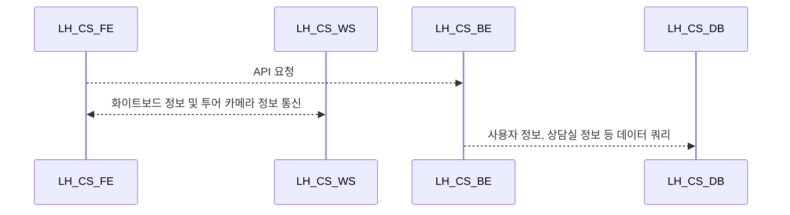

# 서버 아키텍쳐 정리

웹소켓을 함께 사용하는 서버로 인프라 구축 전까지 사용할 개발서버를 사용하며
인프라 구축 후 같은 형상을 새로운 인프라의 개발 환경 및 운영 환경으로 구축한다.

## 개발환경

---

**LH_CS_FE**: 상담사가 사용하는 웹페이지. 상담 투어 생성 및 관리.

**LH_CS_BE**: 상담사(Manager 인증/인가) 상담실, 투어, 설비 정보 등 서브용 백엔드

**LH_CS_WS**: FE 와 양방향 통신을 통해 상담 정보를 주고받는 웹소켓 서버

**LH_CS_DB**: 사용자 정보, 상담실 정보 등 LH 서비스 전반적인 데이터 저장

---

## 운영환경

---

**LH_CS_FE**: 상담사가 사용하는 웹페이지. 상담 투어 생성 및 관리.

**LH_CS_BE**: 상담사(Manager 인증/인가) 상담실, 투어, 설비 정보 등 서브용 백엔드

**LH_CS_WS**: FE 와 양방향 통신을 통해 상담 정보를 주고받는 웹소켓 서버

**LH_CS_DB**: 사용자 정보, 상담실 정보 등 LH 서비스 전반적인 데이터 저장

---
