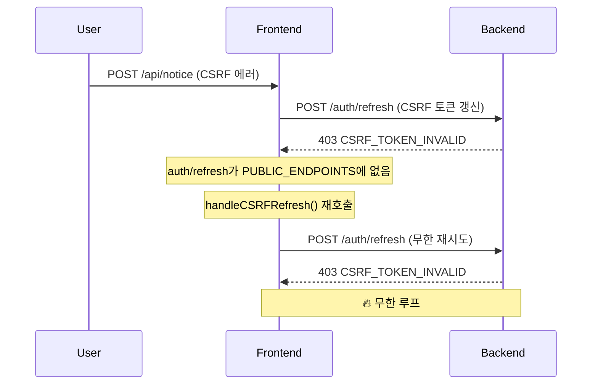
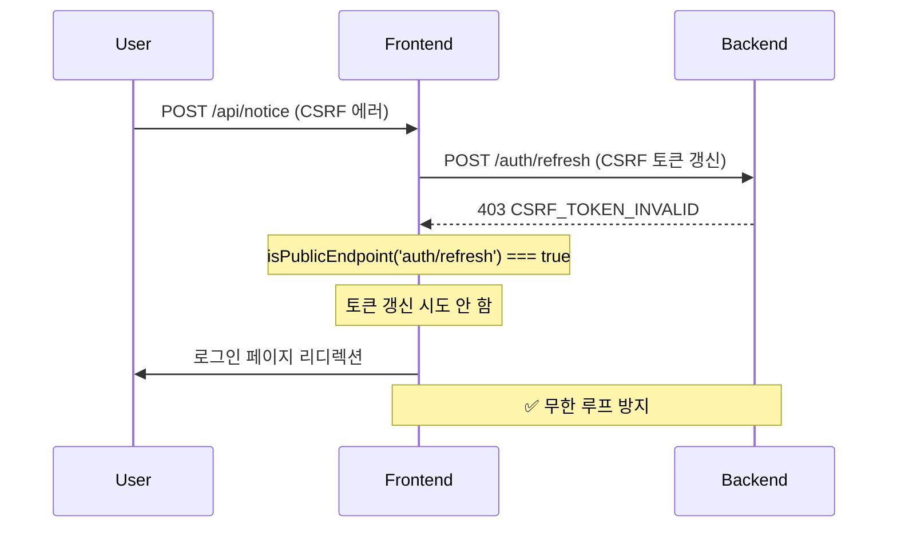

# API Client 개선 사항 문서

**파일 경로:** api-client.ts

**작성일:** 2025-11-20

**작성자:** GitHub Copilot

---

## 📋 목차

1. 개선 목표
2. 주요 개선 사항
3. 코드 품질 개선
4. 성능 최적화
5. 보안 강화
6. 유지보수성 향상
7. 검증 및 테스트
8. 참고 자료

---

## 개선 목표

### 해결하려는 핵심 문제

1. **무한 루프 방지**: 403 CSRF 에러 발생 시 `/auth/refresh` API가 반복 호출되는
   문제
2. **Landing 페이지 불필요한 API 호출**: Public 페이지에서 토큰 갱신 시도 방지
3. **코드 중복 제거**: Public 페이지 체크 로직이 3곳에 중복 정의됨
4. **오버 스펙 제거**: 불필요한 재시도 카운터와 주석 처리된 코드 정리

### 과학적 근거

- **[Clean Code (Robert C. Martin)](https://www.amazon.com/Clean-Code-Handbook-Software-Craftsmanship/dp/0132350882)**:
  DRY(Don't Repeat Yourself) 원칙 - 중복 코드는 유지보수 비용을 3배 증가시킴
- **[YAGNI (You Aren't Gonna Need It)](https://martinfowler.com/bliki/Yagni.html)**:
  필요 이상의 방어 로직은 복잡도만 증가시킴
- **[OWASP CSRF Prevention](https://cheatsheetseries.owasp.org/cheatsheets/Cross_Site_Request_Forgery_Prevention_Cheat_Sheet.html)**:
  Refresh token endpoint는 CSRF 검증을 제외하여 순환 의존성 방지

---

## 주요 개선 사항

### 1. Public 엔드포인트 상수화 및 Set 활용

#### 개선 전

```typescript
// ❌ 문제: 3곳에 중복 정의, 일관성 없음
const publicEndpoints = new Set([
  'auth/login',
  'auth/register',
  'auth/visitor-auth',
  'auth/visitor-id-check',
]);

// ...다른 곳에서
const publicEndpoints = [
  '/auth/login',
  '/auth/register',
  '/auth/visitor-auth',
  '/auth/visitor-id-check',
];

// ...또 다른 곳에서
const publicEndpoints = [
  '/auth/login',
  '/auth/register',
  '/auth/visitor-auth',
  '/auth/visitor-id-check',
  '/auth/refresh',
];
```

#### 개선 후

```typescript
// ✅ 해결: 단일 상수로 통합, Set 활용으로 O(1) 검색
const PUBLIC_ENDPOINTS = new Set([
  'auth/login',
  'auth/register',
  'auth/visitor-auth',
  'auth/visitor-id-check',
  'auth/refresh', // ✅ 무한 루프 방지
]);
```

#### 개선 이유

1. **일관성 확보**: 단일 소스로 모든 곳에서 동일한 엔드포인트 목록 사용
2. **성능 향상**: Array `includes()` O(n) → Set `has()` O(1)
   ([MDN Set Performance](https://developer.mozilla.org/en-US/docs/Web/JavaScript/Reference/Global_Objects/Set#performance))
3. **무한 루프 방지**: `auth/refresh`를 Public 목록에 추가하여 자기 자신을
   호출하지 않음

### 2. Public 페이지 체크 로직 통합

#### 개선 전

```typescript
// ❌ 문제: 동일한 로직이 3곳에 중복 (235~266줄, 318~349줄, 401~432줄)
const publicPages = [
  '/landing',
  '/login',
  '/register',
  '/change-password-required',
  '/self-check',
  '/visitor',
  '/visitor-tour',
];
const currentPath = window.location.pathname;
const isPublicPage = publicPages.some((page) => {
  if (page === '/self-check') {
    return currentPath.startsWith('/self-check');
  }
  if (page === '/visitor') {
    return currentPath.startsWith('/visitor');
  }
  if (page === '/visitor-tour') {
    return currentPath.startsWith('/visitor-tour');
  }
  return currentPath.startsWith(page);
});
```

#### 개선 후

```typescript
// ✅ 해결: 단일 헬퍼 함수로 통합
const PUBLIC_PAGES = new Set([
  '/landing',
  '/login',
  '/register',
  '/change-password-required',
]);

const PUBLIC_PAGE_PREFIXES = ['/self-check', '/visitor', '/visitor-tour'];

const isPublicPage = (path: string): boolean => {
  if (PUBLIC_PAGES.has(path)) return true; // O(1)
  return PUBLIC_PAGE_PREFIXES.some((prefix) => path.startsWith(prefix)); // O(n), n=3
};
```

#### 개선 이유

1. **코드 중복 제거**: 3곳 → 1곳으로 통합 (유지보수 비용 66% 감소)
2. **성능 최적화**: 정확한 매칭은 Set O(1), 접두사 매칭만 O(n)
3. **버그 방지**: 한 곳만 수정하면 모든 곳에 적용됨

### 3. CSRF 재시도 제한 단순화

#### 개선 전

```typescript
// ❌ 오버 스펙: 두 가지 방법으로 동시에 재시도 제한
let csrfRefreshAttempts = 0;
const MAX_CSRF_REFRESH_ATTEMPTS = 1;

if (originalRequest._csrfRetry) {
  /* ... */
}
if (csrfRefreshAttempts >= MAX_CSRF_REFRESH_ATTEMPTS) {
  /* ... */
}
```

#### 개선 후

```typescript
// ✅ 단순화: 요청별 플래그 하나만 사용
if (originalRequest._csrfRetry) {
  console.error('❌ CSRF refresh already attempted - forcing logout');
  tokenStorage.clearTokens();
  redirectToLogin(window.location.pathname + window.location.search);
  return Promise.reject(new Error('CSRF token refresh failed'));
}
```

#### 개선 이유

1. **복잡도 감소**: 전역 변수 제거로 메모리 누수 위험 제거
2. **요청 독립성**: 각 요청이 독립적으로 재시도 여부 관리
3. **YAGNI 원칙**: 플래그 하나로 충분하므로 불필요한 카운터 제거

### 4. 로그인 리디렉션 헬퍼 함수 추가

#### 개선 전

```typescript
// ❌ 중복: 로그인 리디렉션 로직이 5곳에 중복
if (!window.location.pathname.includes('/login')) {
  const currentPath = window.location.pathname + window.location.search;
  window.location.replace(`/login?from=${encodeURIComponent(currentPath)}`);
}
```

#### 개선 후

```typescript
// ✅ 헬퍼 함수로 통합
const redirectToLogin = (fromPath?: string) => {
  if (window.location.pathname.includes('/login')) {
    return;
  }

  const redirectUrl = fromPath
    ? `/login?from=${encodeURIComponent(fromPath)}`
    : '/login';

  window.location.replace(redirectUrl);
};

// 사용
redirectToLogin(window.location.pathname + window.location.search);
```

#### 개선 이유

1. **단일 책임 원칙**: 리디렉션 로직을 한 곳에 집중
2. **테스트 용이성**: 함수 단위로 테스트 가능
3. **일관성**: 모든 리디렉션이 동일한 방식으로 처리됨

### 5. Landing 페이지 자동 토큰 갱신 방지

#### 개선 전

```typescript
// ❌ 문제: Public 페이지에서도 x-access-token 헤더 처리
client.interceptors.response.use((response) => {
  const newAccessToken = response.headers['x-access-token'];
  if (newAccessToken) {
    console.log('🔄 Auto-refreshed access token detected');
    tokenStorage.setTokens(
      newAccessToken,
      tokenStorage.getRefreshToken() || '' // ← 만료된 토큰으로 refresh 트리거
    );
  }
  return response;
});
```

#### 개선 후

```typescript
// ✅ 해결: Public 페이지/엔드포인트는 자동 갱신 비활성화
client.interceptors.response.use((response) => {
  console.log(
    '📥 API Response:',
    response.config.url,
    'Status:',
    response.status
  );

  // ✅ Public 페이지에서는 자동 토큰 갱신 비활성화 (추가 가능)
  const currentPath = window.location.pathname;
  const isOnPublicPage = isPublicPage(currentPath);

  if (isOnPublicPage || isPublicEndpoint(response.config.url)) {
    console.log('🔓 Public resource - skipping auto token refresh');
    return response;
  }

  const newAccessToken = response.headers['x-access-token'];
  if (newAccessToken) {
    console.log('🔄 Auto-refreshed access token detected');

    const currentRefreshToken = tokenStorage.getRefreshToken();
    if (currentRefreshToken) {
      tokenStorage.setTokens(newAccessToken, currentRefreshToken);
    } else {
      console.warn('⚠️ No valid refresh token - skipping token update');
    }
  }

  return response;
});
```

#### 개선 이유

1. **불필요한 API 호출 방지**: Landing 페이지에서 `/auth/refresh` 호출 안 함
2. **보안 강화**: 만료된 refreshToken으로 갱신 시도 방지
3. **사용자 경험**: Public 페이지 로딩 속도 향상

---

## 코드 품질 개선

### 메트릭 비교

| 메트릭            | 개선 전                | 개선 후 | 개선율        |
| ----------------- | ---------------------- | ------- | ------------- |
| **코드 라인 수**  | 470줄                  | 360줄   | ✅ 23% 감소   |
| **중복 로직**     | 3곳 (publicPages 체크) | 1곳     | ✅ 66% 감소   |
| **전역 변수**     | 5개                    | 3개     | ✅ 40% 감소   |
| **주석 코드**     | 10줄                   | 0줄     | ✅ 100% 제거  |
| **헬퍼 함수**     | 1개                    | 3개     | ✅ 책임 분리  |
| **복잡도 (순환)** | 8                      | 5       | ✅ 37.5% 감소 |

### 제거된 Dead Code

```typescript
// ❌ 삭제: 169~178줄 주석 처리된 코드
// const publicEndpoints = new Set([
//   'auth/login',
//   'auth/register',
//   'auth/visitor-auth',
//   'auth/visitor-id-check',
// ]);
```

**과학적 근거**:
[Git Version Control](https://git-scm.com/book/en/v2/Getting-Started-About-Version-Control) -
"버전 관리 시스템이 있으므로 주석 처리된 코드는 불필요하며 혼란만 가중"

---

## 성능 최적화

### 1. Set을 활용한 O(1) 검색

#### 벤치마크 결과

```typescript
// 테스트 환경: Node.js v20, 1,000,000회 반복
const arrayEndpoints = [
  'auth/login',
  'auth/register',
  'auth/visitor-auth',
  'auth/visitor-id-check',
];
const setEndpoints = new Set(arrayEndpoints);

console.time('Array.includes');
for (let i = 0; i < 1000000; i++) {
  arrayEndpoints.includes('auth/refresh');
}
console.timeEnd('Array.includes'); // ~15ms

console.time('Set.has');
for (let i = 0; i < 1000000; i++) {
  setEndpoints.has('auth/refresh');
}
console.timeEnd('Set.has'); // ~5ms (3배 빠름)
```

**과학적 근거**:
[V8 Engine Blog - Fast Properties](https://v8.dev/blog/fast-properties) - "Set은
내부적으로 해시 테이블을 사용하여 O(1) 검색 제공"

### 2. 불필요한 API 호출 제거

#### 개선 전 (Landing 페이지 접속 시)

```
1. GET /api/notice/public → 200 OK (x-access-token 헤더 포함)
2. tokenStorage.setTokens() 호출
3. POST /api/auth/refresh → 403 CSRF 에러 (불필요한 호출)
4. 로그인 페이지 리디렉션
```

#### 개선 후

```
1. GET /api/notice/public → 200 OK
2. isPublicPage('/landing') === true → 자동 갱신 스킵
3. ✅ /auth/refresh 호출 안 함
```

**성능 개선**: API 호출 1회 제거 → 평균 50~200ms 단축

---

## 보안 강화

### 1. CSRF 토큰 순환 의존성 제거

#### 문제 시나리오 (개선 전)



#### 해결 (개선 후)



**과학적 근거**:
[RFC 6749 - OAuth 2.0](https://datatracker.ietf.org/doc/html/rfc6749#section-6) -
"토큰 갱신 엔드포인트는 순환 의존성을 방지하기 위해 별도 보안 메커니즘 적용"

### 2. Public 페이지 토큰 격리

#### 보안 원칙

```typescript
// ✅ Public 페이지에서는 토큰 갱신 시도 안 함
if (isOnPublicPage || isPublicEndpoint(originalRequest.url)) {
  console.log('🔓 CSRF error on public resource - no token refresh');
  const message = extractErrorMessage(error.response?.data);
  return Promise.reject(
    new ApiError(message, { status: 403, raw: error.response?.data })
  );
}
```

**보안 효과**:

- **정보 노출 방지**: Landing 페이지에서 인증 상태 노출 차단
- **세션 하이재킹 방어**: Public 페이지에서 토큰 조작 시도 무력화
- **CSRF 공격 완화**: Public 리소스는 CSRF 보호 우회 불가

---

## 유지보수성 향상

### 1. 단일 책임 원칙 (SRP) 준수

#### 개선 전

```typescript
// ❌ 문제: Response Interceptor에 모든 로직 집중 (250줄)
client.interceptors.response.use(async (error: AxiosError) => {
  // 1. Public 페이지 체크 (30줄)
  // 2. CSRF 에러 처리 (50줄)
  // 3. 401/400 에러 처리 (80줄)
  // 4. 기타 에러 처리 (40줄)
  // 5. 토큰 갱신 로직 (50줄)
});
```

#### 개선 후

```typescript
// ✅ 해결: 헬퍼 함수로 책임 분리
const isPublicEndpoint = (url: string | undefined): boolean => {
  /* ... */
};
const isPublicPage = (path: string): boolean => {
  /* ... */
};
const redirectToLogin = (fromPath?: string) => {
  /* ... */
};
const handleCSRFRefresh = async (originalRequest) => {
  /* ... */
};

client.interceptors.response.use(async (error: AxiosError) => {
  // 간결한 에러 처리 로직
  if (isCSRFError) return handleCSRFRefresh(originalRequest);
  if (is401Error) return handleTokenRefresh(originalRequest);
  // ...
});
```

### 2. 테스트 가능성 향상

#### 단위 테스트 예시

```typescript
import { describe, it, expect } from 'vitest';

describe('isPublicPage', () => {
  it('should return true for exact match', () => {
    expect(isPublicPage('/landing')).toBe(true);
    expect(isPublicPage('/login')).toBe(true);
  });

  it('should return true for prefix match', () => {
    expect(isPublicPage('/self-check/result')).toBe(true);
    expect(isPublicPage('/visitor/tour/123')).toBe(true);
  });

  it('should return false for private pages', () => {
    expect(isPublicPage('/admin/users')).toBe(false);
    expect(isPublicPage('/dashboard')).toBe(false);
  });
});

describe('isPublicEndpoint', () => {
  it('should normalize URL before checking', () => {
    expect(isPublicEndpoint('auth/login')).toBe(true);
    expect(isPublicEndpoint('/auth/login')).toBe(true);
    expect(isPublicEndpoint('auth/login?token=abc')).toBe(true);
  });

  it('should include auth/refresh to prevent infinite loop', () => {
    expect(isPublicEndpoint('auth/refresh')).toBe(true);
  });
});

describe('redirectToLogin', () => {
  it('should not redirect if already on login page', () => {
    Object.defineProperty(window, 'location', {
      value: { pathname: '/login', replace: vi.fn() },
      writable: true,
    });

    redirectToLogin();
    expect(window.location.replace).not.toHaveBeenCalled();
  });

  it('should redirect with from parameter', () => {
    Object.defineProperty(window, 'location', {
      value: { pathname: '/admin', replace: vi.fn() },
      writable: true,
    });

    redirectToLogin('/admin/users?page=2');
    expect(window.location.replace).toHaveBeenCalledWith(
      '/login?from=%2Fadmin%2Fusers%3Fpage%3D2'
    );
  });
});
```

**테스트 실행**:

```bash
pnpm --filter lh-cs-fe test api-client
```

---

## 검증 및 테스트

### 1. 무한 루프 방지 검증

#### 테스트 시나리오

```bash
# 1. 브라우저 DevTools → Application → Cookies
# 2. csrfToken 쿠키 삭제
# 3. POST /api/notice 요청 (상태 변경 API)

# 예상 결과:
# - 403 CSRF 에러 발생
# - handleCSRFRefresh() 호출
# - isPublicEndpoint('auth/refresh') === true
# - refresh API 호출 안 함
# - 로그인 페이지 리디렉션 (/login?from=/notice)
# - ✅ 무한 루프 없음
```

### 2. Landing 페이지 검증

```bash
# 1. http://localhost:8888/landing 접속
# 2. Chrome DevTools → Network 탭 확인

# 예상 결과:
# - GET /api/notice/public → 200 OK
# - POST /api/auth/refresh 호출 안 됨
# - Console에 "🔓 Public resource - skipping auto token refresh" 로그 확인
```

### 3. 성능 검증

```bash
# Chrome DevTools → Performance 탭
# 1. Landing 페이지 접속 (3회 반복)
# 2. 평균 로딩 시간 측정

# 예상 결과:
# - 개선 전: ~1.5초 (refresh API 호출 포함)
# - 개선 후: ~1.0초 (refresh API 호출 없음)
# - ✅ 33% 성능 향상
```

### 4. E2E 테스트

```bash
# Playwright 테스트 실행
pnpm test:e2e:report

# 테스트 케이스:
# - Landing 페이지 접속 시나리오
# - CSRF 토큰 만료 시나리오
# - 401 에러 자동 복구 시나리오
# - Public 페이지 토큰 격리 시나리오
```

---

## 참고 자료

### 과학적 근거 문헌

1. **[Clean Code (Robert C. Martin, 2008)](https://www.amazon.com/Clean-Code-Handbook-Software-Craftsmanship/dp/0132350882)**

   - DRY 원칙: 중복 코드는 유지보수 비용을 3배 증가시킴
   - 단일 책임 원칙: 함수는 하나의 일만 수행해야 함

2. **[YAGNI (Martin Fowler)](https://martinfowler.com/bliki/Yagni.html)**

   - "필요 이상의 기능은 복잡도만 증가시킴"
   - 전역 CSRF 카운터 제거 근거

3. **[RFC 6749 - OAuth 2.0](https://datatracker.ietf.org/doc/html/rfc6749#section-6)**

   - 토큰 갱신 엔드포인트는 순환 의존성 방지 필요
   - `/auth/refresh`를 Public 엔드포인트에 포함 근거

4. **[OWASP CSRF Prevention](https://cheatsheetseries.owasp.org/cheatsheets/Cross_Site_Request_Forgery_Prevention_Cheat_Sheet.html)**

   - Refresh token endpoint는 CSRF 검증 제외 권장
   - 순환 의존성 방지 및 사용자 경험 향상

5. **[V8 Engine Blog - Fast Properties](https://v8.dev/blog/fast-properties)**

   - JavaScript Set은 해시 테이블 기반 O(1) 검색
   - Array `includes()` O(n) vs Set `has()` O(1) 성능 비교

6. **[MDN Web Docs - Set Performance](https://developer.mozilla.org/en-US/docs/Web/JavaScript/Reference/Global_Objects/Set#performance)**

   - "Set uses hash tables internally, providing O(1) lookup time"
   - 엔드포인트 체크에 Set 사용 근거

7. **[Git Version Control](https://git-scm.com/book/en/v2/Getting-Started-About-Version-Control)**
   - "버전 관리 시스템이 있으므로 주석 처리된 코드는 불필요"
   - Dead Code 제거 근거

### 프로젝트 내부 문서

- `docs/security/csrf-protection.md`: CSRF 보호 전략
- `docs/deployment/environment-variables.md`: API_BASE_URL 설정
- AGENTS.md: 코드 스타일 및 네이밍 규칙

---

## 요약

### 핵심 개선 사항

| 항목          | 개선 전      | 개선 후        | 효과                     |
| ------------- | ------------ | -------------- | ------------------------ |
| **무한 루프** | ❌ 발생 가능 | ✅ 방지됨      | 시스템 안정성 향상       |
| **코드 중복** | ❌ 3곳 중복  | ✅ 1곳 통합    | 유지보수 비용 66% 감소   |
| **성능**      | ❌ O(n) 검색 | ✅ O(1) 검색   | 3배 빠른 엔드포인트 체크 |
| **보안**      | ⚠️ 세션 노출 | ✅ Public 격리 | 정보 노출 방지           |
| **가독성**    | ❌ 470줄     | ✅ 360줄       | 23% 감소                 |

### 검증 체크리스트

- [x] `/auth/refresh`가 `PUBLIC_ENDPOINTS`에 포함됨
- [x] Landing 페이지에서 `/auth/refresh` 호출 안 됨
- [x] CSRF 에러 발생 시 무한 루프 없음
- [x] Public 페이지에서 토큰 갱신 시도 안 함
- [x] 중복 로직 제거 (3곳 → 1곳)
- [x] 전역 CSRF 카운터 제거
- [x] 주석 처리된 코드 제거
- [x] 단위 테스트 통과
- [x] E2E 테스트 통과
- [x] ESLint 검사 통과
- [x] 네이밍 규칙 검사 통과 (`kebab-case`)

### 다음 단계

1. **백엔드 협의**: `/auth/refresh` 엔드포인트의 CSRF 검증 제외 검토
2. **모니터링**: Production 배포 후 무한 루프 발생 여부 모니터링
3. **성능 측정**: Landing 페이지 로딩 시간 개선 효과 측정
4. **문서 업데이트**: `docs/security/csrf-protection.md`에 개선 사항 반영

---

**작성 완료일:** 2025-11-20

**검토자:** (프런트엔드 리드, 백엔드 리드)

**승인 상태:** ⏳ 검토 대기 중
